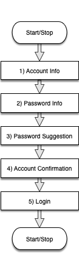
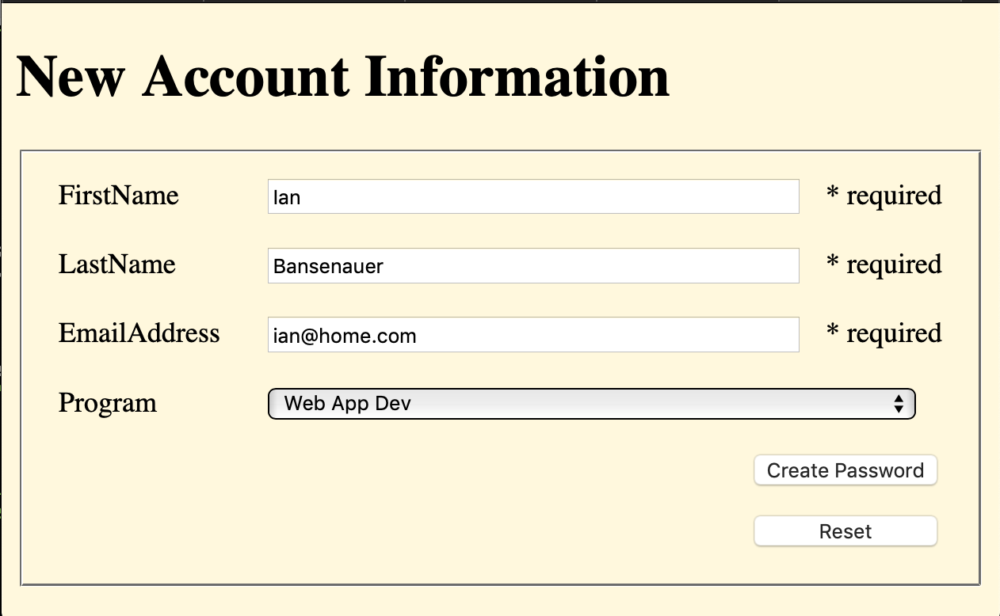
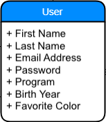

# New Account with Password Suggestion
Overview
--------

Develop a _**New Account with Password suggestions (N.A.P.s)**_ **Use Case** for a Visitor Log application using ASP.NET Core MVC. 

N.A.P.s Use Case
----------------

**Actor**: new application user;   
**Pre-condition**: User does not yet have an account;

#### Scenario 1: Create an Account

User navigates to http://localhost:xxxx/  to begin the account creation process. The user enters personal information, a randomized password is generated using user data. The user accepts or re-generates the password and views their account account creation details before going to the login page.

**Post-Condition**: A User object is created is created based on its  Model with all of the collected information and displayed in a confirmation screen. 

New Account Creation with Password Suggestion Flow

Instructions
------------

Add the MVC service to the project, create Controllers, Views and Model to build the New Account with Password suggestion Use Case.

1.  ### Get the Initial Code
    
    1.  Clone this repository using Visual Studio
    2.  Open and run the Project, navigate to the Account Info page **http://localhost:5001/account-info.html**
    3.  Review all of the other static HTML files in wwwroot.  These are just a prototype demo to show the flow through the web application.
2.  ### Add MVC service and Routing to an action
    
    1.  Add the MVC service in Program.cs
    2.  Configure Routing pipeline to use a default controller _Naps_, and the action _AccountInfo_
    3.  Create a Controller class called _NapsController_ with an _AccountInfo_ Action (BOTH the GET and POST parts)
    4.  To test that your MVC is working, code the \[HttpGet\] method to return a string using _return new ContentResult{ Content = "Hello", ContentType = "text/html" };_
    5.  Run the Project to verify that MVC is working
3.  ### Convert EACH .html files into a Razor-syntax Views (.cshtml) with a shared layout
    
    1.  Move each of the HTML files from the wwwroot to the Views folder
    2.  Create a shared \_Layout.cshtml file that includes all the common HTML (everything but the contents of the <body> element)
    3.  Turn the _account-info.html_ file into _AccountInfo.cshtml_ file; leave only the content unique to this page
    4.  Run the Project to verify that th app displays Account Info as the first page
    5.  Do the same process for all of the other _.html_ pages; check each one using by creating an Action in _NapsController_ for each one.
4.  ### Create a User Model and strongly-typed Razor forms to use it
    
    1.  Create a User Model with the Properties shown as simple get-set string values
    2.  Add the @model to each Razor form to make them strongly-typed
    3.  Use Tag Helpers to expose model to the form label and input tags
5.  ### Create Password Suggestion logic as an Injectable Service
    
    1.  Add a **PasswordSuggestion** class in the Models folder with a single method **generatePassword** that takes a User object and returns a suggested password string
    2.  Include some StringBuilder and Random logic in the method to assign a **randomized** unique password created out of combinations of the User info strings. Make use of at least one of the [**String**](https://learn.microsoft.com/en-us/dotnet/api/system.string?view=net-6.0) class methods, like [**Replace**](https://learn.microsoft.com/en-us/dotnet/api/system.string.replace?view=net-6.0)
    3.  Register the **PasswordSuggestion** class as an app Service for dependency injection; inject it into the SelectPassword View
    4.  Call the **generatePassword** method to populate the _PossiblePasswords_ input field when the page is loaded or reloaded

Screenshots    
----------- 

New Account Information Form

User Entity Model

Submission
----------
Commit your code for the complete web application for the **N.A.P.s Use Case** as described in the Instructions (NB: login functionality is **NOT** required)
